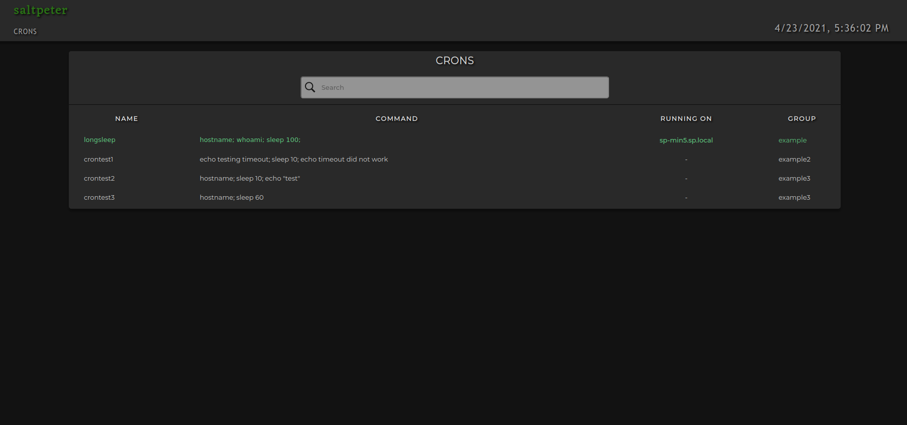
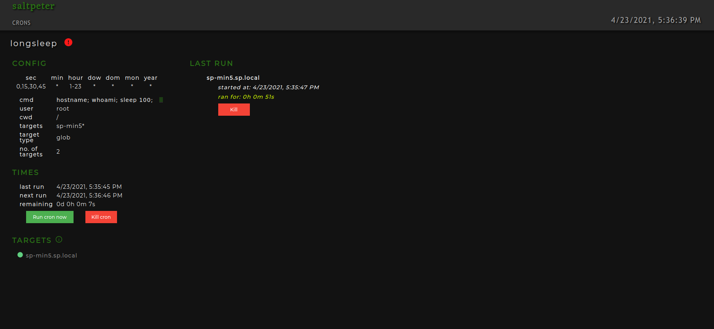
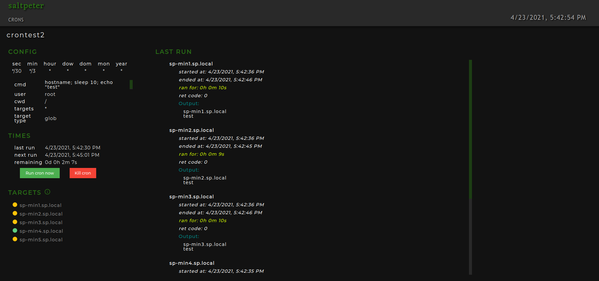

### Description:

User interface for [Saltpeter](https://github.com/syscollective/saltpeter):





### Installation:

Clone the git repository:

```
cd /var/www/
git clone https://github.com/opsicl/saltpeter-ui.git
```

Add the websocket address(the address where [Saltpeter](https://github.com/syscollective/saltpeter) is running):

```
vim /var/www/saltpeter-ui/src/apis.json
```

```
{
  "saltpeter_ws": "ws://localhost:8888/ws"
}
```

Build the project:

```
cd /var/www/saltpeter-ui
sudo npm install
sudo npm build

```

Add the nginx configuration:

```
vim /etc/nginx/sites-available/saltpeter
```

```
server {
  listen 7501;
  server_name localhost;
  root /var/www/saltpeter-ui/build;
  index index.html;
  # Other config you desire (TLS, logging, etc)...
  location / {
    try_files $uri /index.html;
  }
}
```

```
ln -s /etc/nginx/sites-available/saltpeter /etc/nginx/sites-enabled/saltpeter
sudo service nginx restart
```

The UI will be available on the specified port [http://localhost:7501](http://localhost:7501)
